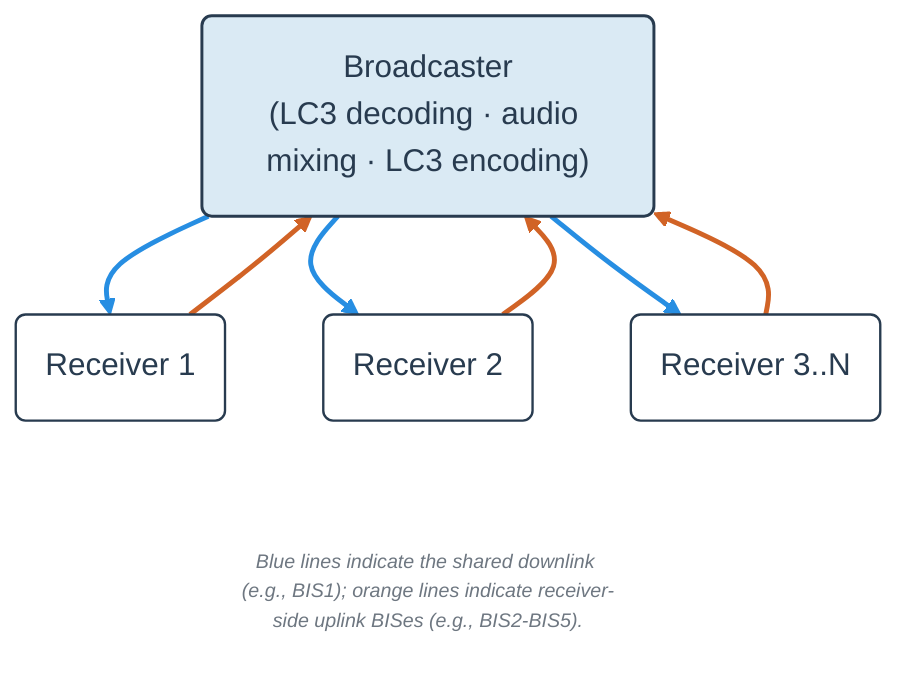

# GRPTLK/COYOTE Audio Workspace

This repository is the west manifest and sample workspace for the GRPTLK/COYOTE audio setup. It contains the GRPTLK audio broadcaster and receiver samples, prebuilt nRF5340 Audio DK binaries, the flashing helper script, and short mode descriptions in `docs/`.

## COYOTE Architecture

COYOTE enables many-to-many voice communication by repurposing BISes within a single Broadcast Isochronous Group (BIG). The broadcaster remains fixed, e.g., `BIS1` carries the shared audio downlink, and the remaining BISes (i.e., `BIS2`-`BISN`) provide receiver-side uplink opportunities.



All receivers continuously receive the shared downlink (also while transmitting audio data uplink). The broadcaster decodes successfully received uplink audio, combines the resulting PCM samples, and encodes the mixed signal for transmission on the shared downlink.

The number of uplink BISes therefore defines the concurrency budget for receiver-side contributions, rather than the number of receivers that may follow the downlink.

### Uplink Selection

A receiver selects an uplink BIS when a talk event starts. For the COYOTE modes evaluated in the paper, the selected BIS is kept until the talk event ends.

The repository provides three selection variants:

- `fully_random`: selects a random uplink BIS on every transmit interval.
- `partly_random`: selects one random uplink BIS per PTT session and keeps it until PTT is released. This corresponds to the random per-talk-event baseline used in the COYOTE evaluation.
- `occupation_aware`: uses broadcaster-provided occupancy information to select among uplink BISes reported as free.

For occupation-aware selection, the broadcaster appends a 4-byte occupancy bitmap to the downlink payload. The bitmap reports recent activity on the provisioned uplink BISes and allows receivers to avoid BISes already in use. The information is advisory and does not assign BISes to individual receivers or require receiver identities or reservations.

## Implementation

The proof-of-concept consists of the COYOTE audio applications in this repository and modifications to the Zephyr Bluetooth controller.

| Component | Location | Purpose |
| --- | --- | --- |
| Broadcaster | [`samples/grptlk_audio_broadcast/`](samples/grptlk_audio_broadcast/) | Receives uplink audio, mixes successfully received contributions, and produces the shared downlink |
| Receiver | [`samples/grptlk_audio_receive/`](samples/grptlk_audio_receive/) | Receives the shared downlink and transmits audio on a selected uplink BIS |
| nRF Connect SDK | [`LENS-TUGraz/sdk-nrf`](https://github.com/LENS-TUGraz/sdk-nrf/tree/v3.1.0-grptlk) | Provides the matching GRPTLK-enabled nRF Connect SDK |
| Zephyr | [`LENS-TUGraz/sdk-zephyr`](https://github.com/LENS-TUGraz/sdk-zephyr/tree/ncs-v3.1.0-grptlk) | Provides the modified Bluetooth controller |

### Controller Support

Using BISes in the receiver-to-broadcaster direction is not Bluetooth Core compliant in the current COYOTE design. The standard Host Controller Interface (HCI) does not expose per-BIS data-path direction within a single BIG.

The proof-of-concept therefore relies on modified Zephyr Bluetooth controller firmware to support transmission and reception within the same BIG. **No hardware modifications are required.**

## Workspace Setup

Use this repository as the local west manifest for the workspace. `west update` fetches the matching GRPTLK-enabled `sdk-nrf` and Zephyr revisions.

```sh
git clone git@github.com:LENS-TUGraz/grptlk.git grptlk
west update
```

or

```sh
git clone git@github.com:LENS-TUGraz/grptlk.git grptlk
west init -l grptlk
west update
```

## Flashing Prebuilt Audio Binaries

Prebuilt GRPTLK audio binaries for the nRF5340 Audio DK are available in `samples/binaries/`.

Binaries are provided for the `fully_random`, `partly_random`, and `occupation_aware` uplink-selection variants with either a `5 ms` or `10 ms` ISO interval.

Use `tools/flash_grptlk_audio.py` to flash a board. The script lets you select the target, ISO interval, and uplink-selection variant and automatically selects the corresponding binary from `samples/binaries/`.

More detailed descriptions of the different modes are available in `docs/`.

## Relay Mode

Flash an nRF5340 DK as broadcaster using one of the prebuilt binaries in `samples/binaries/nrf5340dk/` (e.g., `5ms/bcst_nrf5340dk_5ms_2ch.hex`), then pair it with the matching receiver binary (e.g., `samples/binaries/nrf5340_audio_dk/5ms/fully_random/recv_nrf5340_audio_dk_5ms_fully_random.hex`).

In this configuration, the broadcaster has no audio I/O. It forwards the received uplink data directly without LC3 decoding, audio mixing, or LC3 encoding. The receiver's uplink-selection variant (`fully_random`, `partly_random`, or `occupation_aware`) does not affect the relay operation.

A `10ms/` variant is available under the same folder structure.
